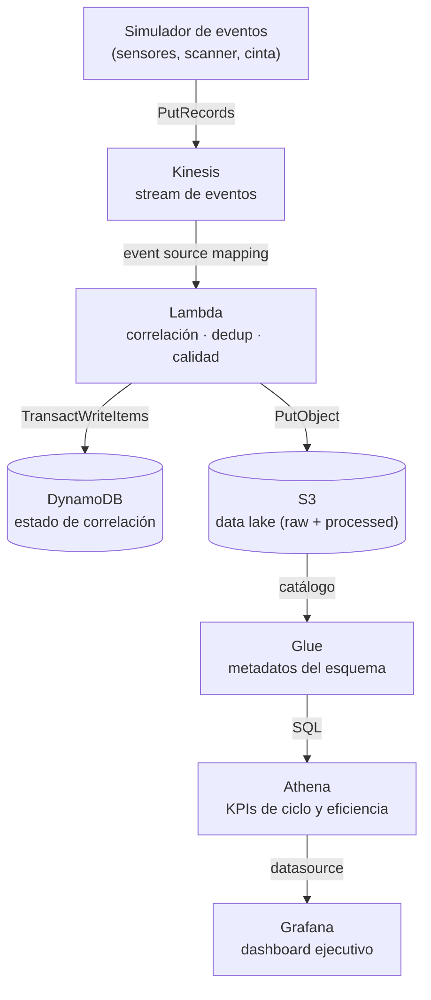
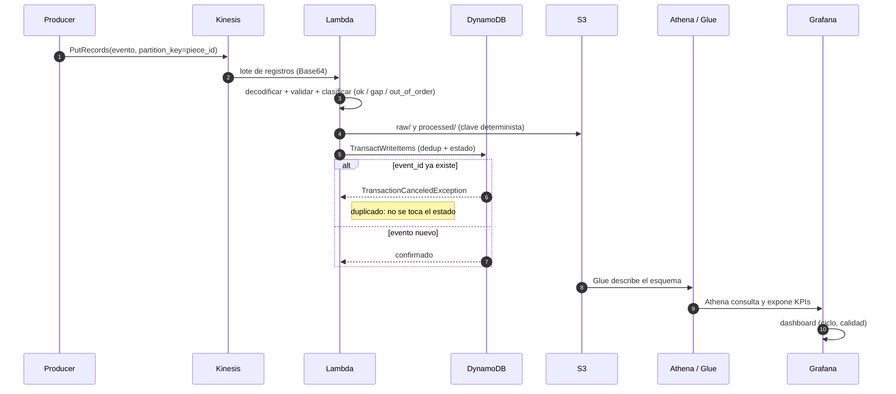

# Real-Time Manufacturing Analytics Pipeline

Pipeline de analítica en tiempo real para planta de manufactura: eventos de sensores, scanner y cinta transportadora se ingieren en streaming, se correlacionan por pieza a través de estaciones, y se exponen como KPIs de ciclo y eficiencia en un dashboard ejecutivo.

Está construido con Kinesis, Lambda, DynamoDB, S3, Athena y Glue — la misma arquitectura que usaría en AWS real — pero corre en local con [Floci](https://floci.io), sin costo ni cuenta de AWS. El `provider` de Terraform apunta a `http://localhost:4566`.
## Autoría

Este proyecto es de mi autoría: el diseño de la arquitectura, el código (productor, Lambda, Terraform, scripts y queries), la configuración del dashboard y esta documentación.

Para ejecutarlo en local uso herramientas de terceros como soporte:

- **[Floci](https://floci.io)**: emulador open-source de AWS que reproduce Kinesis, Lambda, DynamoDB, S3, Glue y Athena en local.
- **[Floci-dash](https://github.com/ofsazib/floci-dash)**: interfaz web de administración de Floci (imagen `ghcr.io/ofsazib/floci-dash`).
- **Grafana**, **Terraform**, **Docker** y **boto3**: herramientas para el dashboard, la infraestructura como código, los contenedores y el SDK de AWS.

Lo que es mío es la solución construida encima de ellas: el pipeline, su lógica de negocio y su infraestructura.

## Por qué este proyecto

Diseñé este pipeline replicando un problema real de planta: correlacionar eventos de una misma pieza a medida que pasa por distintas estaciones, calcular tiempos de ciclo y detectar variabilidad. Esta es la infraestructura completa: streaming, procesamiento serverless, almacenamiento en dos niveles (estado caliente en DynamoDB, histórico en S3) y consultas analíticas con SQL avanzado (CTEs, `LAG`, `STDDEV_POP`).

**Lo que este proyecto demuestra:**
- Diseño de infraestructura como código (Terraform) portable entre local y AWS real
- Arquitectura de streaming con garantías de idempotencia y checkpointing
- SQL analítico sobre un data lake (Athena/Glue) con funciones de ventana
- Un proyecto que se puede clonar y correr en minutos, sin pedir acceso a nadie

## Arquitectura



| Componente | Rol |
|---|---|
| **Simulador de eventos** | Genera eventos sintéticos que imitan sensores, scanner de código de barras y cinta transportadora. |
| **Kinesis** | Ingesta del stream de eventos en orden, particionado por shard. |
| **Lambda** | Correlaciona eventos de una misma pieza entre estaciones, los deduplica y clasifica su calidad. |
| **DynamoDB** | Estado de correlación: qué piezas están "en tránsito" entre estaciones. |
| **S3** | Data lake con eventos raw y procesados. |
| **Athena + Glue** | SQL sobre S3 (CTEs, `LAG`, `STDDEV_POP`) para tiempos de ciclo y variabilidad por estación. |
| **Grafana** | Dashboard ejecutivo con los KPIs resultantes (datasource Athena contra Floci). |

## Diagrama Secuencia


## Decisiones de diseño

- **Idempotencia en Lambda**: cada evento trae un ID único; se registra en DynamoDB con una escritura condicional y se conserva en S3 con clave determinista, de modo que un reintento de Kinesis no duplica su efecto.
- **Checkpointing de lectura**: lo administra el event source mapping de Lambda (Kinesis registra por shard el `sequenceNumber` ya consumido). La tabla `shard_checkpoints` queda reservada para checkpoints de negocio explícitos, aún no implementados.
- **Infra 100% portable**: el `main.tf` no tiene nada hardcodeado a "local"; el endpoint es una variable, así que el mismo código sirve para Floci y para AWS real.
- **Separación infra/código**: `terraform/` no sabe nada de la lógica de negocio; `src/` no sabe nada de cómo se aprovisiona.
- **Athena con DuckDB**: en Floci, Athena es DuckDB detrás de la API de Athena — SQL real (CTEs, `LAG`, `STDDEV_POP`) sobre S3/Glue, sin mantener un servicio de cómputo corriendo 24/7.

## Estructura de repo

```
aws-realtime-pipeline/
├── terraform/               # Kinesis, Lambda, DynamoDB, S3, Glue, Athena, IAM
│   ├── main.tf
│   ├── variables.tf
│   ├── kinesis.tf
│   ├── dynamodb.tf
│   ├── s3.tf
│   ├── lambda.tf
│   ├── glue.tf
│   ├── athena.tf
│   └── outputs.tf
├── src/
│   ├── producer/             # simulador de eventos (Python) → Kinesis
│   └── processor/            # código de la Lambda
├── queries/
│   ├── cycle_kpis.sql        # KPIs de ciclo y variabilidad
│   └── data_quality.sql      # calidad por estación y estado
├── scripts/
│   ├── deploy.sh             # levanta Floci y aplica terraform
│   └── teardown.sh           # destruye recursos locales (controlado)
├── grafana/
│   ├── provisioning/         # datasource Athena + provider de dashboards
│   └── dashboards/           # dashboard JSON de KPIs
├── docker-compose.yml        # Floci, floci-dash y Grafana
└── README.md
```

## Cómo correrlo

```bash
# 1. Levantar Floci (emula los servicios AWS localmente)
docker compose up -d

# 2. Aplicar infraestructura + catálogo
./scripts/deploy.sh

# 3. Generar eventos sintéticos para Kinesis
python3 -m venv .venv
.venv/bin/python -m pip install -r src/producer/requirements.txt
AWS_ACCESS_KEY_ID=test AWS_SECRET_ACCESS_KEY=test \\
    .venv/bin/python src/producer/producer.py --pieces 3

# Perfiles de fallo controlados
AWS_ACCESS_KEY_ID=test AWS_SECRET_ACCESS_KEY=test \\
    .venv/bin/python src/producer/producer.py --pieces 1 --failure-profile duplicates
AWS_ACCESS_KEY_ID=test AWS_SECRET_ACCESS_KEY=test \\
    .venv/bin/python src/producer/producer.py --pieces 1 --failure-profile out_of_order
AWS_ACCESS_KEY_ID=test AWS_SECRET_ACCESS_KEY=test \\
    .venv/bin/python src/producer/producer.py --pieces 1 --failure-profile gaps

# Aislar una corrida para no reutilizar piezas de pruebas anteriores
AWS_ACCESS_KEY_ID=test AWS_SECRET_ACCESS_KEY=test \\
    .venv/bin/python src/producer/producer.py --pieces 1 \\
    --run-id demo-20260908 --failure-profile gaps

# 4. Ejecutar tests unitarios de la Lambda
PYTHONPATH=src/producer .venv/bin/python -m unittest discover \\
    -s src/producer -p 'test_*.py'
PYTHONPATH=src/processor .venv/bin/python -m unittest discover \\
    -s src/processor -p 'test_*.py'

# 5. Limpiar recursos locales antes de repetir una prueba
./scripts/teardown.sh

# Opcional: limpiar recursos y detener también el contenedor Floci
./scripts/teardown.sh --stop-floci
```

Al terminar, Terraform imprime el stream de Kinesis, las tablas de DynamoDB, los buckets S3, la base/tabla Glue y el workgroup Athena.

`teardown.sh` destruye todos los recursos administrados por Terraform (incluidos Glue y Athena). Requiere escribir `DELETE` para continuar y solo permite destruir el endpoint local de Floci (`localhost:4566`); no debe usarse para AWS real.

### Procesamiento e idempotencia de Lambda

Por cada registro, la Lambda:

1. escribe el evento en `raw/` y `processed/` de S3 con claves deterministas (basadas en `event_id`), por lo que la escritura es idempotente;
2. registra el `event_id` en `realtime-pipeline-event-deduplication` y actualiza `realtime-pipeline-correlation-state` en **una única transacción DynamoDB** (`TransactWriteItems`), salvo que el evento llegue fuera de orden (en ese caso solo se registra la deduplicación).

Si Kinesis reintenta el mismo evento, la escritura condicional falla y la transacción se cancela: el evento se cuenta como duplicado sin actualizar el estado de la pieza. Escribir S3 **antes** garantiza que, si la Lambda falla a mitad del procesamiento y el lote se reintenta, los datos raw y procesados nunca se pierden.

El checkpoint de lectura de Kinesis lo administra el event source mapping de Lambda; la tabla `shard_checkpoints` queda reservada para checkpoints de negocio explícitos si el diseño los necesita más adelante.

### Primera consulta analítica

La query [queries/cycle_kpis.sql](queries/cycle_kpis.sql) usa dos CTEs y `LAG` para ordenar los eventos por pieza, identificar la estación anterior y calcular métricas agregadas por estación. Athena fue validada sobre nueve eventos sintéticos y devolvió tres eventos por estación, promedios de ciclo de 3, 4 y 5 segundos, y tres segundos de separación media entre estaciones consecutivas.

La query [queries/data_quality.sql](queries/data_quality.sql) agrupa los eventos procesados por `station_id` y `quality_status`, y cuenta eventos y piezas afectadas. El catálogo Glue incluye `quality_status` para que Athena pueda consultar la calidad del pipeline.

### Particionado por fecha

Los eventos procesados se guardan en `processed/event_date=YYYY-MM-DD/`, y la tabla Glue declara `event_date` como clave de partición, de modo que Athena puede filtrar por fecha sin escanear todo el data lake. Floci descubre las particiones automáticamente (no soporta `MSCK REPAIR TABLE`).

Nota: el campo opcional `missing_stations` (presente solo en eventos `gap`) se dejó fuera del esquema Glue local porque Floci/DuckDB no puede proyectar columnas opcionales en tablas particionadas; en AWS real se restaura como `array<string>`.

### Perfiles de fallo del producer

El producer acepta `--failure-profile` para generar casos controlados:

- `normal`: una secuencia completa por pieza.
- `duplicates`: repite un registro con el mismo `event_id`; permite comprobar la deduplicación de Lambda.
- `out_of_order`: intercambia el orden de publicación de dos estaciones, manteniendo sus timestamps originales.
- `gaps`: omite el evento de `assembly`; permite observar datos incompletos en Athena.

Los perfiles no representan aleatoriedad incontrolable: cada uno cambia una propiedad específica para que el resultado sea reproducible y fácil de explicar en el portafolio.

Lambda agrega `quality_status` al evento procesado. En una validación real, `gaps` produjo `missing_stations: ["assembly"]` y `out_of_order` clasificó el evento atrasado sin sobrescribir el estado más reciente de correlación.

### Dashboard en Grafana

Grafana se levanta con `docker compose up -d` y queda en `http://localhost:3001` (usuario `admin`, contraseña `admin`). El datasource Athena se aprovisiona automáticamente apuntando a `http://floci:4566`, y el dashboard **Manufacturing KPIs** se carga desde `grafana/dashboards/`.

El dashboard tiene dos paneles:

- **Tiempo de ciclo por estación**: `event_count`, promedio y desviación estándar de `cycle_time_seconds`.
- **Calidad por estación y estado**: conteo de eventos y piezas por `quality_status`.

El plugin `grafana-athena-datasource` se instala al arrancar (vía `GF_INSTALL_PLUGINS`) y se configura con un endpoint personalizado y credenciales `test`. En AWS real, se quita el `endpoint` y se usan credenciales/rol reales; el dashboard queda igual.

## Licencia

MIT
